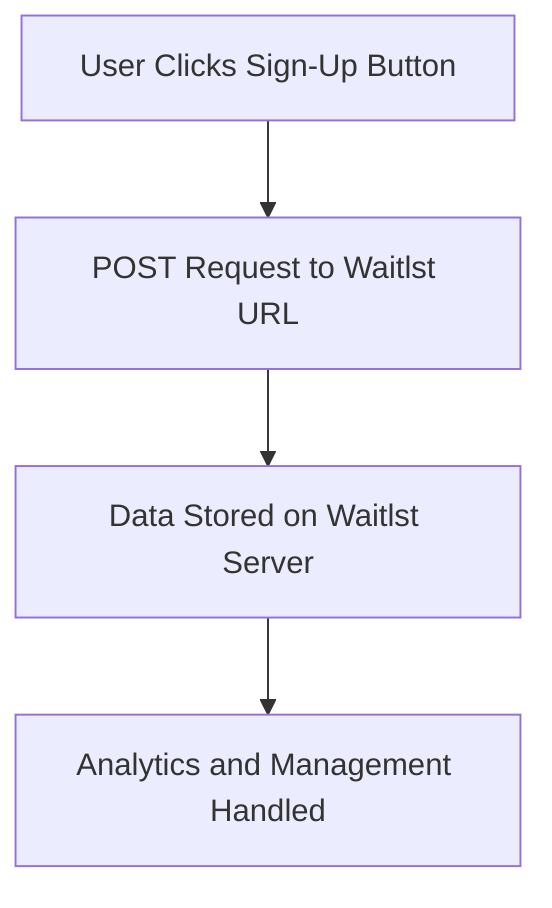

# Waitlst

**Waitlst** is an open-source platform designed to simplify the integration of waiting lists into your website. With Waitlst, you can manage and analyze your email lists with ease. By signing up for an account, you gain access to a unique URL to which you can post requests and add users to your waitlist effortlessly. The platform also provides built-in analytics to help you monitor your audience engagement.

## How it Works

Waitlst operates on a straightforward workflow. Here’s how you can integrate it into your website:

1. **Sign Up**: Create an account on Waitlst to receive a unique URL.
2. **Post Requests**: Use the URL to send a POST request and add users to your email list.
3. **Track Analytics**: Access the dashboard to analyze user sign-ups and engagement metrics.

### Integration Flow

The diagram above highlights the simplicity of integrating Waitlst: a single POST request connects your website to our server, where we handle all storage and analytics.

## How to Contribute

Contributions are welcome and encouraged! Please refer to the [Contribute.md](./CONTRIBUTE.md) file for detailed guidelines on how to contribute to this project. Whether it’s reporting bugs, suggesting features, or submitting pull requests, your input helps us improve.

---

Thank you for using Waitlst. We’re excited to see how you integrate it into your projects!

